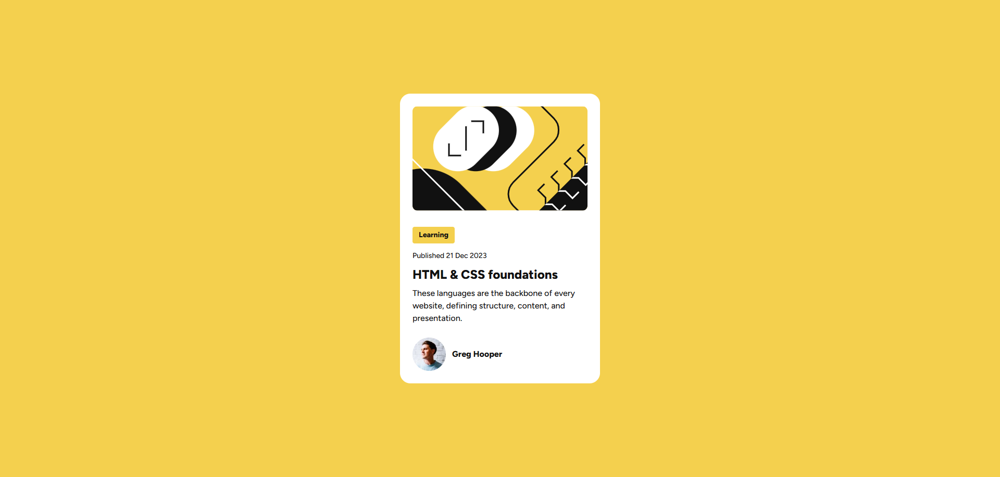
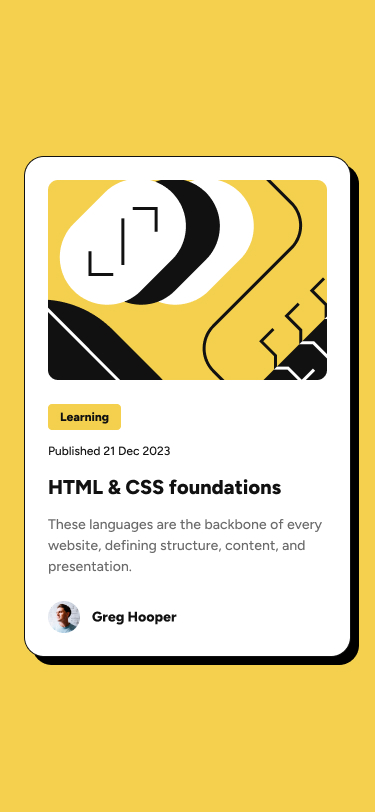

# Frontend Mentor - Blog Preview Card Solution

This is a solution to the [Blog preview card challenge on Frontend Mentor](https://www.frontendmentor.io/challenges/blog-preview-card-ckPaj01IcS).  
Frontend Mentor challenges help you improve your coding skills by building realistic projects.

## Table of Contents

- [Overview](#overview)
  - [Screenshot](#screenshot)
  - [Links](#links)
- [My Process](#my-process)
  - [Built With](#built-with)
  - [What I Learned](#what-i-learned)
  - [Continued Development](#continued-development)
- [Author](#author)

---

## Overview

### Screenshot




### Links

- **Solution URL (GitHub repo):** [[https://github.com/tonmoy-thedeveloper/fem-blog-preview-card]
- **Live Site URL (Hosted demo):** [https://tonmoy-thedeveloper.github.io/fem-blog-preview-card/]

---

## My Process

### Built With

- Semantic HTML5 markup
- CSS custom properties (variables)
- Flexbox for layout
- Mobile-first responsive design

### What I Learned

While working on this project, I improved my skills in:

- Using **CSS variables** for scalable colors, spacing, and typography.
- Creating **inside borders** using `box-shadow: inset`.
- Layering multiple shadows for advanced card designs.
- Centering elements using `margin-inline: auto` and `max-width`.

Example CSS snippet I’m proud of:

```css
.card {
  margin-inline: auto;
  border-radius: 20px;
  max-width: 384px;
  padding: var(--spacing-lg);
  background: var(--color-white);
  box-shadow: inset 0 0 0 1px var(--color-dark-gray), 8px 8px 0 0 var(--color-dark-gray);
}
```

## Author

- Frontend Mentor: [https://www.frontendmentor.io/profile/tonmoy-thedeveloper]
- GitHub: [https://tonmoy-thedeveloper.github.io/fem-blog-preview-card/]
